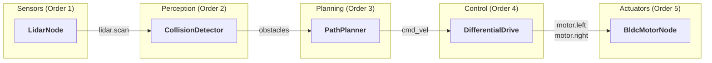

# HORUS Framework

<div align="center">

[](https://github.com/softmata/horus/releases) [](https://www.rust-lang.org/) [](https://www.python.org/) [](LICENSE) [](https://docs.horus-registry.dev/getting-started/installation) [](#performance) [](#performance)

**Hybrid Optimized Robotics Unified System**

A production-grade robotics framework built in Rust for **real-time performance** and **memory safety**. HORUS delivers sub-microsecond IPC latency (50-500x faster than ROS2) while maintaining a simpler developer experience.

[](https://docs.horus-registry.dev) [](https://docs.horus-registry.dev/getting-started/installation) [](https://docs.horus-registry.dev/performance/performance) [](https://discord.gg/hEZC3ev2Nf)

</div>

---

## Why HORUS?

**Coming from ROS/ROS2?** HORUS provides the same multi-process architecture with **significantly better performance** and **memory safety guarantees**. Perfect for hard real-time control, safety-critical systems, and edge robotics.

**New to robotics?** HORUS's simple CLI and single-file project support gets you from zero to working robot code in minutes, not hours.

### vs ROS2

| Feature | HORUS | ROS2 |
|---------|-------|------|
| **Message Latency** | 3ns - 167ns (10 auto-selected backends) | 50us - 500us |
| **Memory Safety** | Rust (zero-cost) | C++ (manual) |
| **Getting Started** | 1 command | 10+ commands + config files |
| **IPC Mechanism** | Wait-free & lock-free shared memory | DDS middleware |
| **Real-time Control** | Native priority scheduling with opt-in RT | Executor model |
| **Learning Curve** | Gentle | Steep |

**When to use HORUS:**
- Hard real-time control (<1ms loops)
- Safety-critical systems
- Edge/embedded robotics
- New projects wanting modern tooling
- Teams valuing simplicity and performance
- Deterministic debugging: Logs include `tick_number` (same every run) to identify execution points across runs

## Built-in Hardware Nodes - Ready for Production

HORUS includes **32 production-ready nodes** with hardware drivers integrated. Unlike ROS2 which requires installing separate packages, HORUS is **batteries included** - start building robots immediately.

### Comprehensive Node Library

| Category | Nodes | Hardware Support |
|----------|-------|------------------|
| **Sensors** | Camera, Depth Camera (RealSense), LiDAR, IMU, GPS, Encoder, Ultrasonic, Force/Torque | Hardware drivers |
| **Actuators** | DC Motor, BLDC Motor (ESC), Stepper, Servo, Dynamixel, Roboclaw | GPIO, PWM, Serial protocols |
| **Safety** | Battery Monitor (I2C), Safety Monitor, Emergency Stop | Production-grade safety features |
| **Communication** | CAN Bus, Modbus, Serial/UART, I2C, SPI, Digital I/O | Industrial protocols |
| **Navigation** | Odometry, Localization, Path Planner, Collision Detector | Differential drive, mecanum, ackermann |
| **Control** | PID Controller, Differential Drive | Real-time control loops |

### Example: Autonomous Robot with Built-in Nodes

Built-in nodes connect via **topics** - just like ROS, but simpler. Here's a complete obstacle-avoiding robot:



```rust
use horus::prelude::*;
use horus_library::prelude::*;

fn main() -> Result<()> {
    // Lightweight by default — no syscalls, no RT overhead
    let mut scheduler = Scheduler::new()
        .with_name("obstacle_avoidance");

    // SAFETY (Order 0) - Always runs first
    scheduler.add(EmergencyStopNode::new("cmd_vel")?)
        .order(0)
        .done();

    // SENSOR (Order 1) - LiDAR publishes to "lidar/scan"
    let mut lidar = LidarNode::new()?;
    lidar.configure_serial("/dev/ttyUSB0", 115200);
    scheduler.add(lidar).order(1).done();

    // PERCEPTION (Order 2) - Subscribes "lidar/scan", publishes "obstacles"
    let mut detector = CollisionDetectorNode::new()?;
    detector.set_safety_distance(0.5);  // 50cm
    scheduler.add(detector).order(2).done();

    // PLANNING (Order 3) - Subscribes "obstacles", publishes "cmd_vel"
    scheduler.add(PathPlannerNode::new()?).order(3).done();

    // CONTROL (Order 4) - Subscribes "cmd_vel", publishes "motor/*"
    let drive = DifferentialDriveNode::new("cmd_vel", "motor/left", "motor/right", 0.3)?;
    scheduler.add(drive).order(4).done();

    // ACTUATORS (Order 5) - Subscribe to motor commands
    let mut left = BldcMotorNode::new()?;
    left.configure_gpio(12, EscProtocol::DShot600);
    left.set_input_topic("motor/left");
    scheduler.add(left).order(5).done();

    let mut right = BldcMotorNode::new()?;
    right.configure_gpio(13, EscProtocol::DShot600);
    right.set_input_topic("motor/right");
    scheduler.add(right).order(5).done();

    scheduler.run()
}
```

**What this robot does:**
1. LiDAR scans environment -> publishes to `lidar/scan`
2. Collision detector finds obstacles -> publishes to `obstacles`
3. Path planner avoids obstacles -> publishes velocity commands to `cmd_vel`
4. Differential drive converts to wheel speeds -> publishes to `motor/left`, `motor/right`
5. BLDC motors drive the wheels

**Order ensures correct execution sequence**: Sensors (1) -> Perception (2) -> Planning (3) -> Control (4) -> Actuators (5)

### vs ROS2: Batteries Included

| Feature | HORUS | ROS2 |
|---------|-------|------|
| **Install** | One framework | Framework + ros-perception + ros-control + ros-navigation + ... |
| **Camera Driver** | Built-in (RealSense) | Install realsense-ros package separately |
| **Motor Control** | Built-in (DC, BLDC, Stepper, Servo) | Install ros2_control + hardware interfaces |
| **Battery Monitor** | Built-in (I2C support) | Write custom node or find package |
| **CAN Bus** | Built-in (SocketCAN) | Install ros2_socketcan package |
| **Safety Monitor** | Built-in (multi-layered) | Write custom or install diagnostic_aggregator |
| **GPS/GNSS** | Built-in (NMEA) | Install nmea_navsat_driver package |
| **Time to Robot** | Minutes | Hours (finding/installing packages) |

### Production Features

All built-in nodes include:
- **Hardware drivers** - I2C, GPIO, Serial, CAN, USB
- **Simulation fallback** - Test without hardware
- **Error handling** - 17-42 error cases per node with recovery
- **Safety features** - Battery alerts, emergency stop, watchdogs
- **Documentation** - 27k+ lines with hardware setup guides
- **Extensible** - Wrap nodes to add custom logic

**Use built-in nodes as-is for 90% of robotics applications. Wrap them only when you need custom algorithms on top.**

See [Built-in Nodes Documentation](horus_library/nodes/README.md) for complete catalog.

## Key Features

### Real-Time Performance
- **10 Auto-Selected Backends**: DirectChannel (~3ns) to MpmcShm (~167ns) — automatic based on topology
- **High Throughput**: 12+ million messages per second sustained
- **Scheduler Presets**: `deploy()`, `safety_critical()`, `high_performance()`, `hard_realtime()`, `deterministic()`
- **Opt-in RT Features**: `.realtime()` for priority scheduling, memory lock, CPU pinning
- **Wait-Free & Lock-Free Communication**: Zero-copy IPC with function-pointer dispatch
- **Parallel Execution**: Multi-core node execution with per-node rate limiting

### Developer Experience
- **Simple Node API**: Clean `tick()` method with lifecycle hooks
- **Macro-Based Development**: `node!` macro eliminates boilerplate
- **Multi-Language Support**: Rust and Python with unified workflow
- **Built-in Logging**: `hlog!()` macro with automatic context capture
- **Unified CLI**: `horus` command for all operations (25+ subcommands)

### Production Ready
- **Memory-Safe Messaging**: Zero-copy POD types prevent corruption
- **Cross-Process Communication**: POSIX shared memory with automatic backend migration
- **Flight Recorder**: `.with_blackbox(mb)` for post-mortem debugging
- **Fault Tolerance**: Circuit breaker pattern with tier-based recovery
- **Monitor**: Web UI and TUI for real-time system monitoring

## Core API

### Scheduler

```rust
use horus::prelude::*;

// Lightweight — no syscalls, no allocations beyond struct
let mut scheduler = Scheduler::new();

// Opt-in to features with builder methods
let mut scheduler = Scheduler::new()
    .realtime()        // RT priority + memory lock + CPU pin (best-effort)
    .with_blackbox(16) // 16MB flight recorder
    .tick_hz(1000.0)   // 1kHz tick rate
    .with_name("my_robot");

// Or use presets for common configurations
let mut scheduler = Scheduler::deploy();           // Production: RT + BlackBox + profiling
let mut scheduler = Scheduler::safety_critical();  // WCET + watchdog + sequential
let mut scheduler = Scheduler::high_performance(); // Parallel + 10kHz
let mut scheduler = Scheduler::deterministic();    // Reproducible execution

// Add nodes with fluent API
scheduler.add(my_node)
    .order(0)          // Execution order: 0 = first
    .rate_hz(100.0)    // Node-specific tick rate
    .done();

// Real-time nodes with WCET and deadline
scheduler.add(motor_controller)
    .order(0)
    .rt()              // Mark as real-time
    .wcet_us(200)      // 200us worst-case execution time
    .deadline_ms(1)    // 1ms deadline
    .done();

// Run options:
scheduler.run()?;                                  // Run continuously until Ctrl+C
scheduler.run_for(Duration::from_secs(10))?;       // Run for duration
scheduler.tick(&["node1", "node2"])?;              // Run specific nodes
```

### Topic (Pub/Sub)

```rust
use horus::prelude::*;

// Create Topic — backend auto-selected based on topology
let topic: Topic<f64> = Topic::new("sensor_data", None)?;

// Send/receive — zero-copy, function-pointer dispatch
topic.send(42.0);           // ~3ns same-thread, ~167ns cross-process
if let Some(msg) = topic.recv() {
    println!("Received: {}", msg);
}

// 10 backends, automatically selected:
//   DirectChannel (~3ns)   — same thread
//   SpscIntra    (~18ns)   — 1P1C same process
//   SpmcIntra    (~24ns)   — 1P-MC same process
//   MpscIntra    (~26ns)   — MP-1C same process
//   MpmcIntra    (~36ns)   — MPMC same process
//   PodShm       (~50ns)   — cross-process POD broadcast
//   MpscShm      (~65ns)   — cross-process MP-1C
//   SpmcShm      (~70ns)   — cross-process 1P-MC
//   SpscShm      (~85ns)   — cross-process 1P1C
//   MpmcShm      (~167ns)  — cross-process MPMC
```

### Message Types

```rust
use horus::prelude::*;

// Option 1: Use the message! macro (zero-copy, automatic traits)
message!(Position = (f32, f32));
message!(Velocity = (f64, f64, f64));

// Option 2: Manual struct with LogSummary
#[derive(Clone, Debug)]
pub struct SensorReading {
    pub value: f64,
}

impl LogSummary for SensorReading {
    fn log_summary(&self) -> String {
        format!("SensorReading({})", self.value)
    }
}
```

### Node Trait

```rust
use horus::prelude::*;

pub trait Node: Send {
    fn name(&self) -> &'static str;                // Required: Node identifier
    fn init(&mut self) -> Result<()> { Ok(()) }    // Optional: Setup logic
    fn tick(&mut self);                             // Required: Main loop logic
    fn shutdown(&mut self) -> Result<()> { Ok(()) } // Optional: Cleanup logic
}
```

### node! Macro

```rust
use horus::prelude::*;

message!(SensorData = (f64, u32));

node! {
    MyNode {
        pub { output: SensorData -> "sensor/output" }
        sub { input: SensorData -> "sensor/input" }
        data { counter: u32 = 0 }

        tick {
            if let Some(value) = self.input.recv() {
                self.counter += 1;
                self.output.send(SensorData(value.0 * 2.0, value.1)).ok();
            }
        }
    }
}
```

## Network Communication

HORUS supports **distributed multi-machine systems** with the same simple API. Just add `@address` to your topic name:

```rust
// Local (shared memory) - 3-167ns latency
let local_topic: Topic<SensorData> = Topic::new("sensors", None)?;

// Network (TCP/UDP) - 5-50us latency
let network_topic: Topic<SensorData> = Topic::new("sensors@192.168.1.100:8000", None)?;
```

### Network Features

| Backend | Latency | Use Case |
|---------|---------|----------|
| **Topic SPSC (TCP)** | 5-15us | Point-to-point, reliable delivery |
| **Topic MPMC (UDP)** | <50us | Pub/sub, broadcasting |
| **QUIC** | ~1ms | WAN, NAT traversal, encryption |
| **io_uring** | 3-5us | Linux ultra-low latency |

Enable optional backends in `Cargo.toml`:
```toml
horus_core = { version = "0.1", features = ["quic", "io-uring-net"] }
```

## CLI Commands

HORUS provides 25+ commands via `horus`:

| Command | Description |
|---------|-------------|
| `horus new <name>` | Create new project (Rust, Python, or macro) |
| `horus run [files]` | Build and run project or files |
| `horus build [files]` | Build without running |
| `horus test [filter]` | Run tests with `--sim`, `--integration` options |
| `horus check [path]` | Validate workspace, horus.yaml, or source files |
| `horus monitor [port]` | Web UI or TUI system monitor |
| `horus topic list\|echo\|pub` | Topic interaction |
| `horus node list\|info\|kill` | Node management |
| `horus param get\|set\|list` | Parameter management |
| `horus hf list\|echo\|tree` | HFrame coordinate transforms |
| `horus msg list\|show\|fields` | Message type introspection |
| `horus log [node]` | View and filter logs |
| `horus launch <file>` | Launch multiple nodes from YAML |
| `horus pkg install\|remove\|list` | Package management |
| `horus env freeze\|restore\|show\|list` | Environment management |
| `horus deploy <target>` | Deploy to remote robot |
| `horus driver list\|info\|search` | Driver management |
| `horus plugin list\|enable\|disable` | Plugin management |
| `horus add <name>` | Smart add (auto-detects package/driver/plugin) |
| `horus remove <name>` | Smart remove |
| `horus record list\|play\|info` | Recording/replay management |
| `horus net check\|ping\|scan` | Network diagnostics |
| `horus cache info\|clean\|purge` | Cache management |
| `horus auth login\|logout\|whoami` | Authentication |
| `horus clean [--shm]` | Clean build artifacts / shared memory |
| `horus sim [--2d]` | Launch 2D or 3D simulator |

## Package Management

HORUS includes a built-in package registry for sharing and reusing nodes:

```bash
horus pkg list --search lidar     # Search available packages
horus pkg install sensor-fusion   # Install a package
horus add lidar-driver            # Smart add (auto-detects type)
horus pkg publish                 # Publish your own package
```

Packages are installed to `~/.horus/cache/` and can include nodes, messages, drivers, and plugins.

## Multi-Language Support

HORUS enables **Python and Rust nodes to run together in a single system**, communicating seamlessly through shared topics:

- **Rust nodes** for low-level real-time control (motor controllers, sensor fusion, safety monitors)
- **Python nodes** for high-level algorithms (AI/ML models, computer vision, path planning)

### Python

```bash
pip install horus-robotics
```

```python
import horus

def process(node):
    node.send("output", 42.0)

node = horus.Node(pubs="output", tick=process, rate=30)
horus.run(node, duration=5)
```

See [horus_py/README.md](horus_py/README.md) for complete documentation.

## Installation

### Prerequisites

**Required:**
- **Rust 1.92+** (install from [rustup.rs](https://rustup.rs))
  ```bash
  curl --proto '=https' --tlsv1.2 -sSf https://sh.rustup.rs | sh
  ```

- **Build tools**
  ```bash
  # Ubuntu/Debian
  sudo apt update && sudo apt install build-essential pkg-config libudev-dev libssl-dev libasound2-dev

  # macOS
  xcode-select --install && brew install pkg-config openssl
  ```

**Optional (for Python bindings):**
- **Python 3.9+**

### Quick Install

```bash
git clone https://github.com/softmata/horus.git
cd horus
./install.sh
```

### Verify Installation

```bash
horus --version
```

## Quick Start

```bash
horus new my_robot
cd my_robot
horus run --release
```

## Performance

### Topic Backend Latencies

| Backend | Topology | Latency |
|---------|----------|---------|
| DirectChannel | Same thread, 1P-1C, POD | ~3ns |
| SpscIntra | Same process, 1P-1C | ~18ns |
| SpmcIntra | Same process, 1P-MC | ~24ns |
| MpscIntra | Same process, MP-1C | ~26ns |
| MpmcIntra | Same process, MPMC | ~36ns |
| PodShm | Cross process, POD broadcast | ~50ns |
| MpscShm | Cross process, MP-1C | ~65ns |
| SpmcShm | Cross process, 1P-MC | ~70ns |
| SpscShm | Cross process, 1P-1C | ~85ns |
| MpmcShm | Cross process, MPMC | ~167ns |

### Real-Time Suitability

| Control Rate | Requirement | HORUS |
|--------------|-------------|-------|
| 1 kHz | < 1 ms | PASS |
| 10 kHz | < 100 us | PASS |
| 100 kHz | < 10 us | PASS |

## Workspace Structure

| Crate | Description |
|-------|-------------|
| `horus` | Unified entry point (`use horus::prelude::*`) |
| `horus_core` | Core framework: Node, Topic, Scheduler, Memory |
| `horus_macros` | Procedural macros (`node!`, `message!`) |
| `horus_library` | Standard message types and built-in nodes |
| `horus_manager` | CLI tool (`horus` command) |
| `horus_ai` | ML model registry and AI types |
| `horus_py` | Python bindings via PyO3 |
| `benchmarks` | Performance benchmarks |

## Contributing

We welcome contributions! See [CONTRIBUTING.md](CONTRIBUTING.md) for guidelines.

**Important:** All pull requests should target the `dev` branch.

## License

Apache License 2.0 - see [LICENSE](LICENSE) for details.
