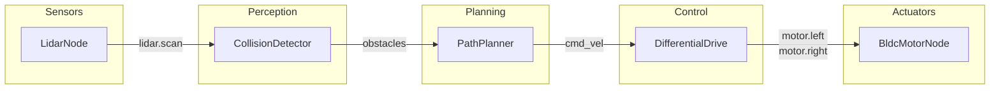

# HORUS Framework

<div align="center">

[](https://github.com/softmata/horus/releases) [](https://www.rust-lang.org/) [](https://www.python.org/) [](LICENSE) [](https://docs.horus-registry.dev/getting-started/installation) [](#performance) [](#performance)

**A production-grade robotics framework built in Rust.**

Sub-microsecond messaging, memory safety, and 32 built-in hardware nodes. Get from zero to working robot in minutes.

[](https://docs.horus-registry.dev) [](https://docs.horus-registry.dev/getting-started/installation) [](https://docs.horus-registry.dev/performance/performance) [](https://discord.gg/hEZC3ev2Nf)

</div>

---

## Quick Start

```bash
# Install
git clone https://github.com/softmata/horus.git && cd horus && ./install.sh

# Create and run a project
horus new my_robot
cd my_robot
horus run
```

## Why HORUS?

| | HORUS | ROS2 |
|---|---|---|
| **Message Latency** | Sub-microsecond (auto-optimized) | 50-500 microseconds |
| **Memory Safety** | Rust (guaranteed) | C++ (manual) |
| **Getting Started** | `horus new` | 10+ commands + config files |
| **Hardware Nodes** | 32 built-in | Install packages separately |
| **Languages** | Rust + Python | C++ + Python |

**HORUS is for you if:**
- You need hard real-time control (<1ms loops)
- You want batteries-included hardware support
- You're starting a new robotics project
- You value simplicity and performance

## Example: Obstacle-Avoiding Robot



```rust
use horus::prelude::*;
use horus_library::prelude::*;

fn main() -> Result<()> {
    let mut scheduler = Scheduler::new()
        .with_name("obstacle_avoidance");

    // Safety first
    scheduler.add(EmergencyStopNode::new("cmd_vel")?)
        .order(0).done();

    // LiDAR sensor
    let mut lidar = LidarNode::new()?;
    lidar.configure_serial("/dev/ttyUSB0", 115200);
    scheduler.add(lidar).order(1).done();

    // Detect obstacles
    let mut detector = CollisionDetectorNode::new()?;
    detector.set_safety_distance(0.5);
    scheduler.add(detector).order(2).done();

    // Plan path around obstacles
    scheduler.add(PathPlannerNode::new()?).order(3).done();

    // Convert velocity to wheel speeds
    let drive = DifferentialDriveNode::new("cmd_vel", "motor/left", "motor/right", 0.3)?;
    scheduler.add(drive).order(4).done();

    // Drive motors
    let mut left = BldcMotorNode::new()?;
    left.configure_gpio(12, EscProtocol::DShot600);
    left.set_input_topic("motor/left");
    scheduler.add(left).order(5).done();

    let mut right = BldcMotorNode::new()?;
    right.configure_gpio(13, EscProtocol::DShot600);
    right.set_input_topic("motor/right");
    scheduler.add(right).order(5).done();

    scheduler.run()
}
```

Order controls execution sequence: Sensors (1) -> Perception (2) -> Planning (3) -> Control (4) -> Actuators (5).

## Built-in Hardware Nodes

32 production-ready nodes with drivers included. No extra packages to install.

| Category | Nodes |
|----------|-------|
| **Sensors** | Camera, Depth Camera (RealSense), LiDAR, IMU, GPS, Encoder, Ultrasonic, Force/Torque |
| **Actuators** | DC Motor, BLDC Motor, Stepper, Servo, Dynamixel, Roboclaw |
| **Safety** | Battery Monitor, Safety Monitor, Emergency Stop |
| **Communication** | CAN Bus, Modbus, Serial/UART, I2C, SPI, Digital I/O |
| **Navigation** | Odometry, Localization, Path Planner, Collision Detector |
| **Control** | PID Controller, Differential Drive |

All nodes include hardware drivers, simulation fallback for testing without hardware, and comprehensive error handling.

See [Built-in Nodes Documentation](horus_library/nodes/README.md) for the full catalog.

## Core Concepts

### Scheduler

The scheduler runs your nodes in order at a configurable rate:

```rust
use horus::prelude::*;

let mut scheduler = Scheduler::new()
    .with_name("my_robot")
    .tick_hz(1000.0);          // 1kHz loop rate

// Add nodes with execution order
scheduler.add(sensor_node).order(1).done();
scheduler.add(control_node).order(2).rate_hz(100.0).done(); // Per-node rate

scheduler.run()?;
```

**Presets** for common use cases:

```rust
Scheduler::deploy()           // Production: real-time + flight recorder
Scheduler::safety_critical()  // Watchdogs + sequential execution
Scheduler::high_performance() // Parallel execution + 10kHz
Scheduler::deterministic()    // Reproducible execution for debugging
```

### Topics (Pub/Sub)

Nodes communicate through topics. The framework automatically picks the fastest transport:

```rust
use horus::prelude::*;

let topic: Topic<f64> = Topic::new("sensor_data", None)?;

topic.send(42.0);
if let Some(value) = topic.recv() {
    println!("Got: {}", value);
}
```

For multi-machine setups, just add an address:

```rust
// Same-machine: shared memory (sub-microsecond)
let local: Topic<f64> = Topic::new("sensors", None)?;

// Cross-machine: network (microseconds)
let remote: Topic<f64> = Topic::new("sensors@192.168.1.100:8000", None)?;
```

### Custom Nodes

Define nodes with the `node!` macro:

```rust
use horus::prelude::*;

message!(SensorData = (f64, u32));

node! {
    MyNode {
        pub { output: SensorData -> "sensor/output" }
        sub { input: SensorData -> "sensor/input" }
        data { counter: u32 = 0 }

        tick {
            if let Some(value) = self.input.recv() {
                self.counter += 1;
                self.output.send(SensorData(value.0 * 2.0, value.1)).ok();
            }
        }
    }
}
```

Or implement the `Node` trait directly for full control.

## Python Support

Rust and Python nodes run together in the same system, communicating through shared topics:

```bash
pip install horus-robotics
```

```python
import horus

def process(node):
    node.send("output", 42.0)

node = horus.Node(pubs="output", tick=process, rate=30)
horus.run(node, duration=5)
```

Use Rust for real-time control, Python for AI/ML and high-level logic.

## CLI

```bash
horus new my_robot          # Create project
horus run                   # Build and run
horus test                  # Run tests
horus monitor               # Real-time system monitor (Web UI + TUI)
horus topic list            # See active topics
horus node list             # See running nodes
horus pkg install <name>    # Install packages
horus deploy <target>       # Deploy to robot
horus sim                   # Launch simulator
```

Run `horus --help` for all commands.

## Installation

### Prerequisites

- **Rust 1.92+**: `curl --proto '=https' --tlsv1.2 -sSf https://sh.rustup.rs | sh`
- **Build tools**:
  ```bash
  # Ubuntu/Debian
  sudo apt install build-essential pkg-config libudev-dev libssl-dev libasound2-dev

  # macOS
  xcode-select --install && brew install pkg-config openssl
  ```
- **Python 3.9+** (optional, for Python bindings)

### Install

```bash
git clone https://github.com/softmata/horus.git
cd horus
./install.sh
horus --version
```

## Performance

HORUS automatically selects the fastest communication backend based on your system topology:

| Scenario | Latency |
|----------|---------|
| Same thread | ~3 ns |
| Same process | 18-36 ns |
| Cross process | 50-167 ns |
| Cross machine (LAN) | 5-50 us |

Tested real-time suitability: 1kHz, 10kHz, and 100kHz control loops all pass.

See [benchmarks/](benchmarks/) for details and reproduction steps.

## Contributing

We welcome contributions! See [CONTRIBUTING.md](CONTRIBUTING.md) for guidelines.

All pull requests should target the `dev` branch.

## License

Apache License 2.0 - see [LICENSE](LICENSE) for details.
